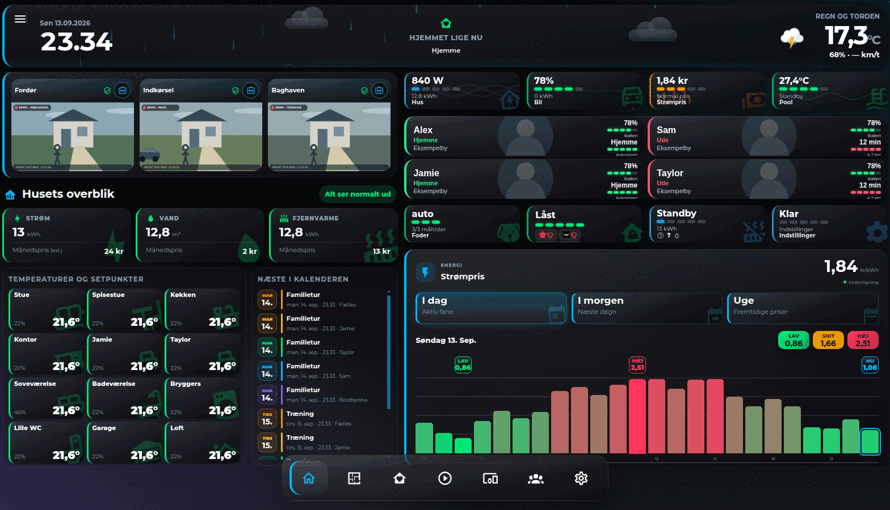
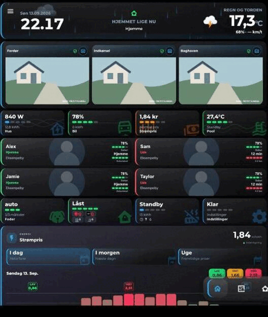

# MRDonnii Smart Home Cards

One organized Home Assistant card collection instead of dozens of separate HACS installations.

The collection keeps every card as an independent source module, but publishes one tested JavaScript bundle and one HACS update. Existing custom element names and Lovelace YAML remain unchanged.

## Status

This repository is the migration target for the existing standalone card repositories. The first releases are intentionally marked pre-release while compatibility is verified. Do not remove an existing standalone HACS installation until the corresponding card is confirmed here.

## Screenshots

Rendered from the neutral demo dashboard used for compatibility testing — synthetic camera feeds and placeholder names only, no household data.

| Desktop | Mobile |
|---|---|
|  |  |

## Install with HACS

1. Open HACS.
2. Add `https://github.com/MRDonnii/ha-smart-home-cards` as a custom Dashboard repository.
3. Install **MRDonnii Smart Home Cards**.
4. Reload the browser.

HACS adds the bundled resource `ha-smart-home-cards.js`. Do not load a standalone resource for the same card at the same time after migration.

## Card catalog

The generated [catalog](docs/CARDS.md) groups all cards by purpose and links to their original repositories during the migration period.

## Repository layout

```text
src/cards/<card>/   Independent card source and local assets
src/index.js        Generated bundle entry
scripts/            Build and validation
docs/CARDS.md       Searchable card catalog
dist/               Generated HACS bundle, not committed
```

## Development

```bash
npm ci
npm test
```

## Compatibility promise

- Existing `custom:...` card types stay unchanged.
- Existing Lovelace configuration remains valid.
- Cards remain separated internally and can be maintained independently.
- The old repositories remain available throughout the migration.

## Privacy

The collection ships with neutral example values. Personal names, addresses, private network addresses, credentials and household-specific defaults are not permitted in published source or release artifacts. See [the privacy policy](docs/PRIVACY.md).

## Integrations are separate

Backend integrations such as Wavin Calefa, Dantherm HCH PassiveLink and Room Energy Optimizer are not part of this frontend bundle and continue in their own repositories.
