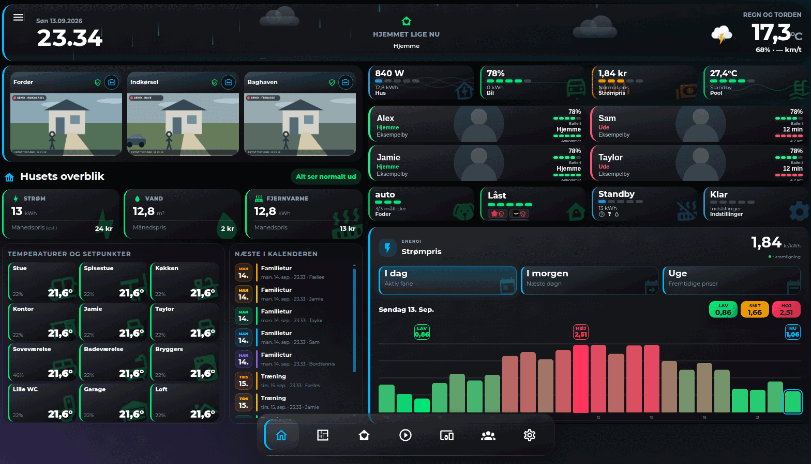
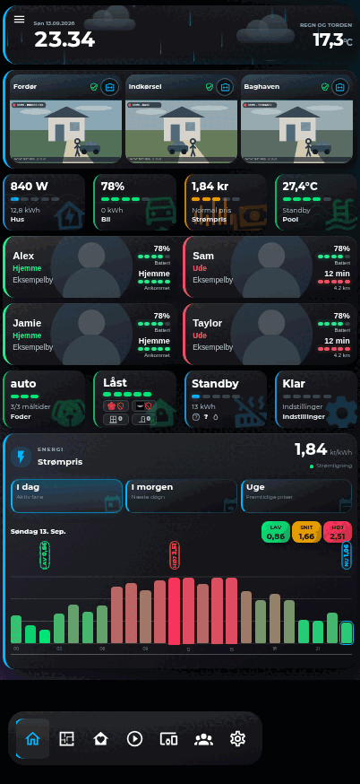

# MRDonnii Smart Home Cards

One organized Home Assistant card collection instead of dozens of separate HACS installations.

The collection keeps every card as an independent source module, but publishes one tested JavaScript bundle and one HACS update. Existing custom element names and Lovelace YAML remain unchanged.

## Status

This repository is the single, canonical home for all cards. New cards are developed, committed, pushed and released here — never as new standalone repositories. The old standalone card repositories are archived migration history and receive no new development. Do not remove an existing standalone HACS installation until the corresponding card is confirmed here.

## Screenshots

Rendered from the neutral demo dashboard used for compatibility testing — animated synthetic camera feeds and placeholder names only, no household data. The mobile preview is captured at the iPhone 17 Pro logical viewport (402 × 874) with Home Assistant Companion page zoom set to 75%.

| Desktop | Mobile |
|---|---|
|  |  |

## Install with HACS

1. Open HACS.
2. Add `https://github.com/MRDonnii/ha-smart-home-cards` as a custom Dashboard repository.
3. Install **MRDonnii Smart Home Cards**.
4. Reload the browser.

HACS adds the bundled resource `ha-smart-home-cards.js`. Do not load a standalone resource for the same card at the same time after migration.

## Card catalog

The generated [catalog](docs/CARDS.md) groups all cards by purpose. Entries for cards migrated from standalone repositories still link to the archived original repositories for detailed configuration examples.

Recent additions include the Tesla dashboard, TTS center, light automation, family calendar, waste journey and battery status cards. The Home Status module also provides `custom:ha-home-desktop-layout-card` for separate desktop, mobile and portrait compositions.

### Room Overview V2

`custom:ha-home-room-overview-card-v2` is the new compact room overview. Each room keeps only temperature, humidity, one status line and a single room-light action visible. Pressing the room opens a solid, lightly blurred control dialog for climate, covers, media, openings and optional extra entities. An existing Bubble Card room popup can remain linked as the advanced fallback.

V2 uses a separate custom-element name, so it can be tested next to the original room card without replacing it. State updates change existing nodes in place and do not rebuild open dialogs or restart their contents.

```yaml
type: custom:ha-home-room-overview-card-v2
title: All rooms
desktop_columns: 4
rooms:
  - name: Living room
    icon: mdi:sofa-outline
    temperature: sensor.living_room_temperature
    humidity: sensor.living_room_humidity
    light: light.living_room
    presence: binary_sensor.living_room_presence
    opening: binary_sensor.living_room_window
    climate: climate.living_room
    cover: cover.living_room
    media_player: media_player.living_room
    extra_entities: switch.living_room_air_cleaner
    popup: '#living-room'
```

## Repository layout

```text
src/cards/<card>/   Independent card source and local assets
src/index.js        Generated bundle entry
scripts/            Build and validation
docs/CARDS.md       Searchable card catalog
dist/               Generated HACS bundle, not committed
```

## Development

```bash
npm ci
npm test
```

## Adding a new card

Always create new cards inside this repository:

1. Create `src/cards/<card-name>/` with the card source and local assets.
2. Register the card in `cards.json` (slug, name, filename, category).
3. Run `npm test` to regenerate the bundle entry and validate.
4. Commit, push to `main` and publish a release from this repository.

Never create a new standalone `ha-*-card` repository on GitHub, and never push new card development to the archived standalone repositories.

## Compatibility promise

- Existing `custom:...` card types stay unchanged.
- Existing Lovelace configuration remains valid.
- Cards remain separated internally and can be maintained independently.
- The old standalone repositories are archived migration history; all new development and releases happen here.

## Weather card: radar image, warnings and extra measurements

v0.4.80 redesigns the card: a hero with key figures, a 7-day list with temperature range bars, the radar beside it on
wide screens, and the extra measurements as compact panels in up to three columns. v0.4.81 fills very wide screens: from 1300 px
everything below the hourly forecast flows as three balanced columns.

`ha-weather-card` can show an `image` entity in its radar section (`radar_image_entity`, for example a national radar
with lightning), warnings from a sensor's attribute list (`warnings_entity`, yellow/orange/red banners at the top) and
any sensors as groups of tiles (`detail_sections`). Tiles and the radar image update in place, so the card is not rebuilt
and the wind map is not reloaded on every sensor update. See the
[card docs](https://github.com/MRDonnii/ha-smart-home-cards/blob/main/src/cards/ha-weather-card).

## Home header card: sky clouds

v0.4.82 draws the clouds of the V3 weather backdrop (`weather_style_v3: true`) as a soft, drifting cloud layer (WebGL,
value-noise clouds as in a 3D sky) instead of the drawn cloud shapes. The amount follows the weather entity's
`cloud_coverage` (or the condition), the clouds drift with `wind_bearing`/`wind_speed`, and they are lit white by day,
warm at dusk and dark at night (`sun_entity` elevation). They are drawn at a third of the card's size at most ~20 times
a second, stop while the card is off screen or the page is hidden, and stand still with `animation: false` or reduced
motion. Set `weather_v3_clouds: css` to keep the drawn clouds; without WebGL the drawn clouds are used automatically.

## Animations rest when nobody uses the screen

The cards' endless animations (drifting tile icons, breathing glows, flowing lines) run while someone uses the screen and
stand still after 30 seconds without a touch, click, key or scroll; the next one wakes them. A running animation makes
the browser redraw the page on every frame: on a wall display this took views from 30–55 % GPU to 0–5 % at rest.
Alarm, error, warning and critical animations always keep moving. To keep every animation running on one device, set
`localStorage.setItem("shc-motion", "always")` in that browser.

## Privacy

The collection ships with neutral example values. Personal names, addresses, private network addresses, credentials and household-specific defaults are not permitted in published source or release artifacts. See [the privacy policy](docs/PRIVACY.md).

## Integrations are separate

Backend integrations such as Wavin Calefa, Dantherm HCH5 Control and Room Energy Optimizer are not part of this frontend bundle and continue in their own repositories.
